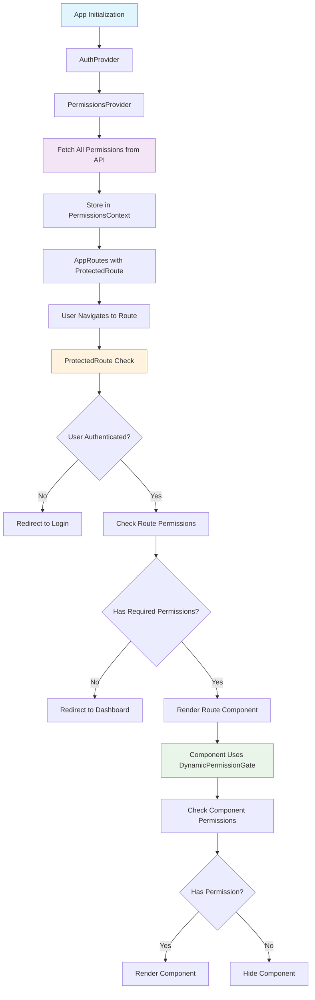
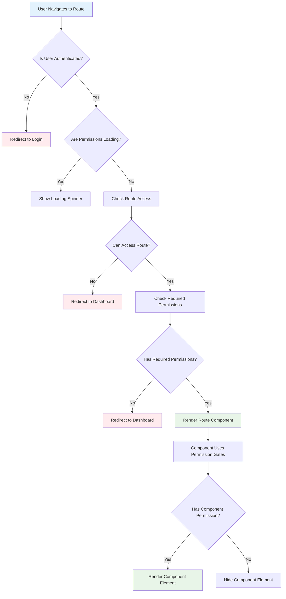

# Dynamic Permissions System

This system allows you to work with permissions dynamically without hardcoding them in `permissions.ts`. It fetches all available permissions from the API and provides utilities to check permissions using any permission slug.

## Key Benefits

- ✅ **No more hardcoding**: Add new features without updating `permissions.ts`
- ✅ **API-driven**: Permissions are fetched from your backend
- ✅ **Flexible**: Works with any permission slug pattern
- ✅ **Backward compatible**: Existing code continues to work
- ✅ **Type-safe**: Full TypeScript support
- ✅ **Route-level protection**: Automatic permission checking for all routes
- ✅ **Component-level gates**: Conditional rendering based on permissions

## 🔄 Permission Flow Architecture

The dynamic permissions system follows a comprehensive flow from app initialization to route protection and component rendering.

### System Architecture Flow



### Detailed Permission Flow

#### 1. **App Initialization & Context Setup**
```typescript
// App.tsx
<AuthProvider>                    // Provides user authentication
  <PermissionsProvider>           // Fetches and provides all permissions
    <AppRoutes />                 // Route definitions with protection
  </PermissionsProvider>
</AuthProvider>
```

#### 2. **Permission Data Fetching**
```typescript
// PermissionsContext.tsx
const { permissions, permissionsMap, isLoading, error } = usePermissionsMap();
// ↓ API Call: GET /admin/authorization/v1/permissions
// ↓ Returns: PaginatedResponse<Permission>
// ↓ Extracts: permissions.data (Permission[])
```

#### 3. **Route Protection Setup**
```typescript
// AppRoutes.tsx
<Route path="users/*" element={
  <ProtectedRoute requiredPermissions={['user-index', 'user-view']}>
    <UserRoutes />
  </ProtectedRoute>
} />
```

#### 4. **Permission Checking Flow**
```typescript
// ProtectedRoute.tsx
const ProtectedRoute = ({ children, requiredPermissions = [] }) => {
  // Step 1: Check authentication
  if (!isAuthenticated) return <Navigate to="/login" />;
  
  // Step 2: Check route access using dynamic permissions
  const canAccess = canAccessRoute(location.pathname);
  
  // Step 3: Check specific required permissions
  const hasRequiredPermissions = hasAnyPermission(requiredPermissions);
  
  // Step 4: Allow or redirect based on permissions
  if (!canAccess || !hasRequiredPermissions) {
    return <Navigate to="/dashboard" />;
  }
  
  return <>{children}</>;
};
```

#### 5. **Dynamic Permission Validation**
```typescript
// useDynamicPermissions.ts
export const useDynamicPermissions = () => {
  const { user } = useAuth();                    // Get current user
  const { permissions } = usePermissionsContext(); // Get all permissions
  
  return {
    hasPermission: (permission: string) => checkPermission(user, permission),
    hasAnyPermission: (permissions: string[]) => hasAnyPermission(user, permissions),
    canAccessRoute: (route: string) => canAccessRoute(user, route),
  };
};
```

#### 6. **Permission Validation Logic**
```typescript
// dynamicPermissions.ts
export const hasPermission = (user: User | null, permission: string): boolean => {
  // Extract user's permissions from role
  const userPermissions = user?.role?.permissions?.map(p => p.slug) || [];
  
  // Check if permission exists in user's permissions
  return userPermissions.includes(permission);
};
```

### Route Protection Examples

#### Example 1: User tries to access `/users`
1. **Route Match**: AppRoutes matches `/users/*` → ProtectedRoute
2. **Authentication Check**: ✅ User is authenticated
3. **Route Permission Check**: `canAccessRoute('/users')` → checks for `user-index` or `user-view`
4. **Required Permission Check**: `hasAnyPermission(['user-index', 'user-view'])`
5. **Result**: ✅ User has permission → Renders UserRoutes

#### Example 2: User tries to access `/roles` without permission
1. **Route Match**: AppRoutes matches `/roles/*` → ProtectedRoute
2. **Authentication Check**: ✅ User is authenticated
3. **Route Permission Check**: `canAccessRoute('/roles')` → checks for `roles-index` or `roles-view`
4. **Required Permission Check**: `hasAnyPermission(['roles-index', 'roles-view'])` → ❌ No permission
5. **Result**: ❌ User lacks permission → Redirects to `/dashboard`

### Component-Level Permission Gates

#### Sidebar Navigation
```typescript
// Sidebar.tsx
{navigation.map((item) => (
  <DynamicPermissionGate key={item.name} permission={item.permission}>
    <Link to={item.href}>
      <item.icon />
      <span>{item.name}</span>
    </Link>
  </DynamicPermissionGate>
))}
```

#### Page Components
```typescript
// UsersPage.tsx
<DynamicPermissionGate permission="user-store">
  <Button onClick={() => navigate("/users/create")}>
    Add User
  </Button>
</DynamicPermissionGate>
```

## Quick Start

### 1. Basic Permission Check

```tsx
import { useDynamicPermissions } from '../hooks/useDynamicPermissions';

const MyComponent = () => {
  const { hasPermission } = useDynamicPermissions();
  
  // Check any permission by slug
  const canViewUsers = hasPermission('user-index');
  const canCreateRoles = hasPermission('roles-store');
  const canAccessNewFeature = hasPermission('new-feature-access');
  
  return (
    <div>
      {canViewUsers && <button>View Users</button>}
      {canCreateRoles && <button>Create Role</button>}
      {canAccessNewFeature && <button>New Feature</button>}
    </div>
  );
};
```

### 2. Using Permission Gates

```tsx
import DynamicPermissionGate from '../components/DynamicPermissionGate';

const MyComponent = () => {
  return (
    <div>
      {/* Single permission */}
      <DynamicPermissionGate permission="user-index">
        <button>View Users</button>
      </DynamicPermissionGate>

      {/* Multiple permissions (any) */}
      <DynamicPermissionGate 
        permissions={['user-store', 'user-update']}
        fallback={<div>No access</div>}
      >
        <button>Manage Users</button>
      </DynamicPermissionGate>

      {/* Multiple permissions (all required) */}
      <DynamicPermissionGate 
        permissions={['user-store', 'user-update', 'user-destroy']}
        requireAll={true}
      >
        <button>Full User Management</button>
      </DynamicPermissionGate>
    </div>
  );
};
```

### 3. Resource-Specific Permissions

```tsx
import { useResourcePermissions } from '../hooks/useDynamicPermissions';

const UserManagement = () => {
  const userPermissions = useResourcePermissions('user');
  
  return (
    <div>
      {userPermissions.canView() && <button>View Users</button>}
      {userPermissions.canCreate() && <button>Create User</button>}
      {userPermissions.canEdit() && <button>Edit User</button>}
      {userPermissions.canDelete() && <button>Delete User</button>}
    </div>
  );
};
```

### 4. Advanced Usage

```tsx
import { useDynamicPermissions } from '../hooks/useDynamicPermissions';

const AdvancedExample = () => {
  const { 
    hasPermission, 
    hasAnyPermission, 
    hasAllPermissions,
    permissions,
    getPermissionsByPattern,
    permissionExists 
  } = useDynamicPermissions();

  // Check specific permissions
  const canManageUsers = hasAnyPermission(['user-store', 'user-update', 'user-destroy']);
  const canFullyManageRoles = hasAllPermissions(['roles-store', 'roles-update', 'roles-destroy']);

  // Get all permissions for a resource
  const userPermissions = getPermissionsByPattern('user');
  const rolePermissions = getPermissionsByPattern('role');

  // Check if a permission exists
  const hasNewFeature = permissionExists('new-feature-access');

  return (
    <div>
      {/* Your component logic */}
    </div>
  );
};
```

## 🔍 Permission Checking Flow Details

### Step-by-Step Flow Example

Let's trace what happens when a user tries to access the `/users` route:

#### **Step 1: App Initialization**
```typescript
// App.tsx
<AuthProvider>                    // 1. Provides user authentication state
  <PermissionsProvider>           // 2. Fetches all permissions from API
    <AppRoutes />                 // 3. Defines protected routes
  </PermissionsProvider>
</AuthProvider>
```

#### **Step 2: Permission Data Loading**
```typescript
// PermissionsContext.tsx
const { permissions, permissionsMap, isLoading, error } = usePermissionsMap();
// ↓ Makes API call: GET /admin/authorization/v1/permissions?limit=1000
// ↓ Receives: PaginatedResponse<Permission>
// ↓ Extracts: permissions.data (Permission[])
// ↓ Creates: permissionsMap (Record<string, Permission>)
```

#### **Step 3: Route Definition**
```typescript
// AppRoutes.tsx
<Route path="users/*" element={
  <ProtectedRoute requiredPermissions={['user-index', 'user-view']}>
    <UserRoutes />
  </ProtectedRoute>
} />
```

#### **Step 4: User Navigation**
When user clicks on "Users" in sidebar or navigates to `/users`:

#### **Step 5: ProtectedRoute Execution**
```typescript
// ProtectedRoute.tsx
const ProtectedRoute = ({ children, requiredPermissions = ['user-index', 'user-view'] }) => {
  const { isAuthenticated, isLoading } = useAuth();
  const { canAccessRoute, hasAnyPermission, isLoading: permissionsLoading } = useDynamicPermissions();
  
  // 5a. Check loading states
  if (isLoading || permissionsLoading) {
    return <LoadingSpinner />;
  }
  
  // 5b. Check authentication
  if (!isAuthenticated) {
    return <Navigate to="/login" />;
  }
  
  // 5c. Check route access
  const canAccess = canAccessRoute('/users'); // Checks for user-index or user-view
  
  // 5d. Check required permissions
  const hasRequiredPermissions = hasAnyPermission(['user-index', 'user-view']);
  
  // 5e. Decision
  if (!canAccess || !hasRequiredPermissions) {
    return <Navigate to="/dashboard" />;
  }
  
  return <>{children}</>; // Renders UserRoutes
};
```

#### **Step 6: Dynamic Permission Validation**
```typescript
// useDynamicPermissions.ts
export const useDynamicPermissions = () => {
  const { user } = useAuth();                    // Get current user
  const { permissions } = usePermissionsContext(); // Get all permissions
  
  return {
    hasPermission: (permission: string) => checkPermission(user, permission),
    hasAnyPermission: (permissions: string[]) => hasAnyPermission(user, permissions),
    canAccessRoute: (route: string) => canAccessRoute(user, route),
  };
};
```

#### **Step 7: Permission Checking Logic**
```typescript
// dynamicPermissions.ts
export const hasPermission = (user: User | null, permission: string): boolean => {
  // Extract user's permissions from their role
  const userPermissions = user?.role?.permissions?.map(p => p.slug) || [];
  
  // Check if the requested permission exists in user's permissions
  return userPermissions.includes(permission);
};

export const canAccessRoute = (user: User | null, route: string): boolean => {
  // Convert route to permission pattern
  const routePermissions = getRoutePermissions(route);
  // /users → ['user-index', 'user-view']
  // /roles → ['roles-index', 'roles-view']
  
  return hasAnyPermission(user, routePermissions);
};
```

#### **Step 8: Component Rendering**
Once the route is accessible, components can use permission gates:

```typescript
// UsersPage.tsx
const UsersPage = () => {
  return (
    <div>
      <h1>Users</h1>
      
      {/* Only show if user has create permission */}
      <DynamicPermissionGate permission="user-store">
        <Button onClick={() => navigate("/users/create")}>
          Add User
        </Button>
      </DynamicPermissionGate>
      
      {/* Only show if user has any user management permission */}
      <DynamicPermissionGate permissions={['user-update', 'user-destroy']}>
        <UserManagementActions />
      </DynamicPermissionGate>
    </div>
  );
};
```

### Permission Checking Decision Tree



### Error Handling & Edge Cases

#### **Loading States**
- **Authentication Loading**: Shows loading spinner while checking if user is logged in
- **Permissions Loading**: Shows loading spinner while fetching permissions from API
- **Combined Loading**: Handles both states to prevent premature redirects

#### **Permission Errors**
- **API Errors**: Gracefully handles network failures when fetching permissions
- **Missing Permissions**: User sees appropriate fallback UI when permissions are missing
- **Invalid Permissions**: System handles invalid permission slugs gracefully

#### **Fallback Behavior**
- **No Route Permission**: Redirects to `/dashboard`
- **No Component Permission**: Hides the component (or shows fallback)
- **No Authentication**: Redirects to `/login`

## Migration Guide

### From Hardcoded to Dynamic

**Before (hardcoded):**
```tsx
import { PERMISSIONS } from '../utils/permissions';
import { usePermissions } from '../hooks/usePermissionCheck';

const MyComponent = () => {
  const { hasPermission } = usePermissions();
  
  return (
    <div>
      {hasPermission(PERMISSIONS.USERS_VIEW) && <button>View Users</button>}
    </div>
  );
};
```

**After (dynamic):**
```tsx
import { useDynamicPermissions } from '../hooks/useDynamicPermissions';

const MyComponent = () => {
  const { hasPermission } = useDynamicPermissions();
  
  return (
    <div>
      {hasPermission('user-index') && <button>View Users</button>}
    </div>
  );
};
```

### Permission Slug Patterns

The system works with any permission slug pattern. Common patterns include:

- `{resource}-{action}`: `user-index`, `roles-store`, `media-destroy`
- `{resource}-{action}-{subaction}`: `user-role-assign`, `media-bulk-delete`
- Custom patterns: `dashboard-analytics`, `reports-export`, `settings-advanced`

## API Integration

The system automatically fetches permissions from your API using the existing `permissionService.getPermissions()` method. Make sure your API returns permissions in this format:

```typescript
interface Permission {
  id: number;
  name: string;
  slug: string;
  display_name: string;
  description: string;
  status: string;
  created_at: string;
  updated_at: string;
}
```

## Performance

- Permissions are cached for 10 minutes (staleTime)
- Cache is kept for 30 minutes (cacheTime)
- Only one API call per session
- Automatic refetching when needed

## Error Handling

The system gracefully handles:
- Network errors
- Missing permissions
- Invalid permission slugs
- Loading states

## Examples

See `src/examples/DynamicPermissionsExample.tsx` for a comprehensive example showing all features.

## 🎯 Implementation Summary

### What Was Implemented

1. **Context-Based Permission Management**
   - `PermissionsProvider` fetches all permissions on app initialization
   - `PermissionsContext` provides permissions throughout the app
   - Automatic permission fetching when user logs in

2. **Route-Level Protection**
   - `ProtectedRoute` component wraps all routes
   - Each route specifies required permissions
   - Automatic redirects for unauthorized access

3. **Component-Level Gates**
   - `DynamicPermissionGate` for conditional rendering
   - Sidebar navigation items are permission-gated
   - Page components use permission gates for actions

4. **Dynamic Permission Checking**
   - `useDynamicPermissions` hook for permission checking
   - Works with any permission slug pattern
   - No hardcoded permission constants needed

### Key Files Modified

```
src/
├── contexts/
│   ├── AuthContext.tsx          # Added PermissionsProvider wrapper
│   └── PermissionsContext.tsx   # Fetches and provides permissions
├── components/
│   ├── Layout/Sidebar.tsx       # Added DynamicPermissionGate to nav items
│   └── ProtectedRoute.tsx       # Updated to use dynamic permissions
├── hooks/
│   ├── usePermissions.ts        # Added missing permission hooks
│   └── useDynamicPermissions.ts # Main permission checking hook
├── routes/
│   └── AppRoutes.tsx            # Added ProtectedRoute to all routes
└── utils/
    └── README_DYNAMIC_PERMISSIONS.md # This documentation
```

### Best Practices

#### **1. Permission Naming Convention**
```typescript
// Use consistent patterns
const permissions = {
  view: 'resource-index',      // List view
  create: 'resource-store',    // Create action
  edit: 'resource-update',     // Update action
  delete: 'resource-destroy',  // Delete action
  show: 'resource-show',       // Detail view
  viewRoute: 'resource-view',  // Route access
};
```

#### **2. Route Protection Pattern**
```typescript
// Always wrap routes with ProtectedRoute
<Route path="resource/*" element={
  <ProtectedRoute requiredPermissions={['resource-index', 'resource-view']}>
    <ResourceRoutes />
  </ProtectedRoute>
} />
```

#### **3. Component Permission Gates**
```typescript
// Use DynamicPermissionGate for conditional rendering
<DynamicPermissionGate permission="resource-store">
  <Button>Create Resource</Button>
</DynamicPermissionGate>

// Use fallback for better UX
<DynamicPermissionGate 
  permission="resource-destroy"
  fallback={<span>No delete permission</span>}
>
  <Button>Delete Resource</Button>
</DynamicPermissionGate>
```

#### **4. Loading State Handling**
```typescript
// Always handle loading states
const { isLoading, hasPermission } = useDynamicPermissions();

if (isLoading) {
  return <LoadingSpinner />;
}

// Check permissions after loading
if (hasPermission('resource-index')) {
  return <ResourceList />;
}
```

### Performance Considerations

- **Permission Caching**: Permissions are cached for 10 minutes
- **Single API Call**: Permissions are fetched once per session
- **Context Optimization**: Permissions are stored in React context for fast access
- **Lazy Loading**: Permission checks are performed only when needed

### Security Considerations

- **Server-Side Validation**: Always validate permissions on the backend
- **Client-Side UX**: Permission gates are for UX only, not security
- **Permission Refresh**: Permissions are refreshed when user data changes
- **Fallback Handling**: Graceful degradation when permissions are missing

## Backward Compatibility

The existing `permissions.ts` system continues to work. The dynamic system is additive and doesn't break existing code. You can migrate gradually or use both systems together.
